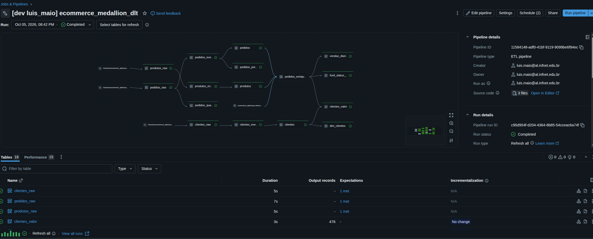
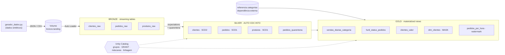
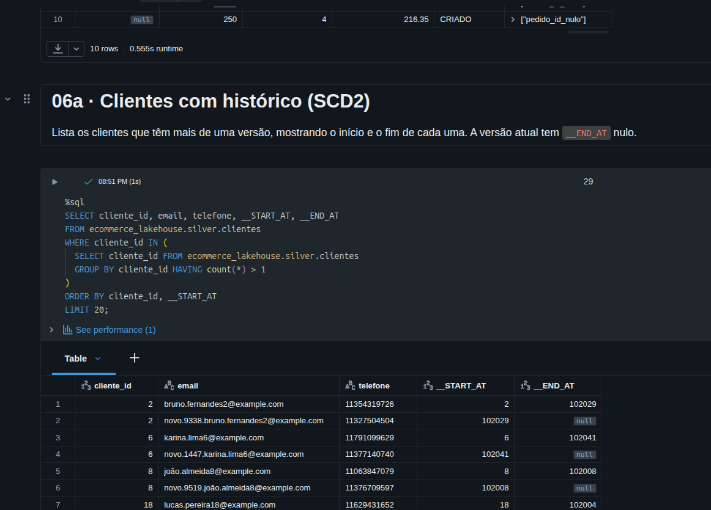
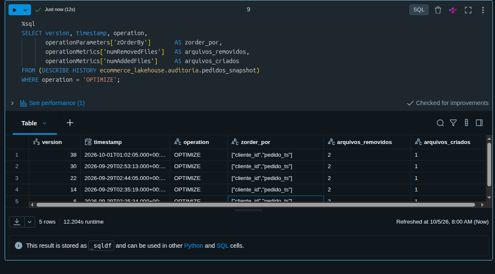
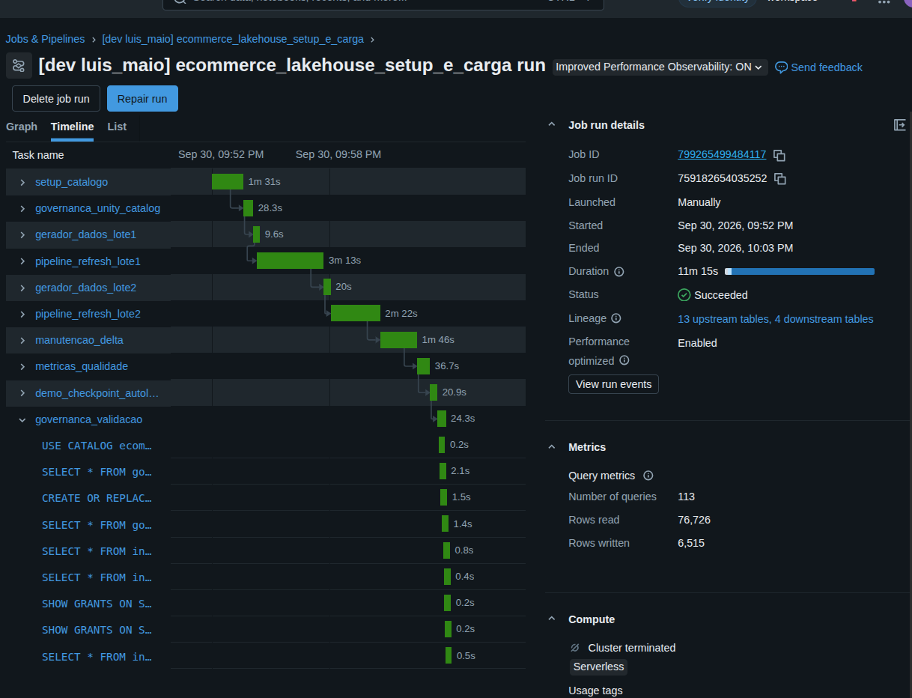
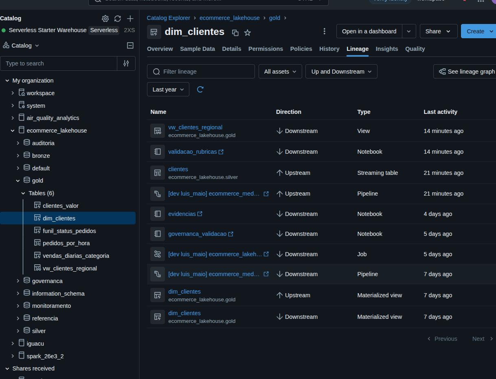
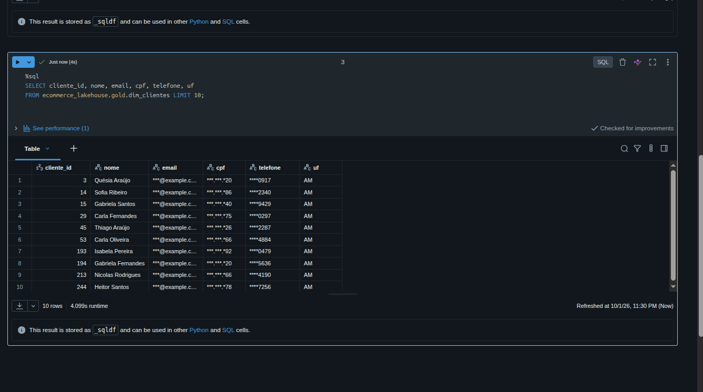

# E-commerce Data Lakehouse — Databricks, Delta Lake e Unity Catalog

Pipeline de dados de ponta a ponta para um cenário de e-commerce, no padrão **Medallion**
(bronze → silver → gold), construído com **Lakeflow Declarative Pipelines** (antigo Delta Live
Tables) em **SQL**, governado pelo **Unity Catalog** e empacotado como **Databricks Asset
Bundle** (infraestrutura como código). Roda em computação **serverless** na Databricks Free
Edition.

**Stack:** Databricks · Delta Lake · Lakeflow Declarative Pipelines · Auto Loader · Unity Catalog ·
Databricks Asset Bundles · SQL · Python



## O que o projeto demonstra

| Tema | Como aparece no projeto |
|---|---|
| **Ingestão incremental** | Auto Loader (`STREAM read_files`) lê só os arquivos novos de um Volume do Unity Catalog; dados fora do schema vão para `_rescued_data` |
| **Qualidade de dados** | Expectations em três severidades (avisar, descartar, falhar) e uma tabela de **quarentena** que guarda o pedido rejeitado com o motivo |
| **Change Data Capture** | `AUTO CDC INTO` com **SCD Tipo 2** para clientes (histórico completo) e **SCD Tipo 1** para pedidos e produtos, incluindo deletes e eventos fora de ordem |
| **Governança** | Grupos de conta, `GRANT` por camada, funções de **máscara** de PII (e-mail, CPF, telefone), tags e linhagem no Unity Catalog |
| **Transações Delta** | Time travel, `RESTORE`, `MERGE`, deletion vectors e leitura do `_delta_log` via `DESCRIBE HISTORY` |
| **Performance** | Z-Order, liquid clustering (`CLUSTER BY`), compactação automática, `OPTIMIZE` e `VACUUM` |
| **Streaming** | Watermark e janelas em `gold.pedidos_por_hora`; checkpoint e `dropDuplicatesWithinWatermark` em um Auto Loader standalone |
| **Observabilidade** | Métricas de qualidade e duração lidas do event log do pipeline |
| **Automação** | 3 jobs (carga completa, ingestão por chegada de arquivo, manutenção agendada) e deploy reprodutível com um comando |

## Arquitetura



- **Bronze:** cópia fiel dos eventos, sem regra de negócio, com `arquivo_origem` e `data_ingestao`.
- **Silver:** dados validados e com as mudanças aplicadas (SCD1/SCD2). Pedidos inválidos vão para `pedidos_quarentena`.
- **Gold:** agregações de negócio com liquid clustering, uma dimensão com PII mascarada e uma
  streaming table com watermark.

## Resultados da execução

Dois lotes de dados sintéticos (o segundo traz updates, deletes, mudanças de status e um evento
de cliente fora de ordem). Contagens lidas diretamente do workspace:

| Etapa | Resultado |
|---|---|
| Bronze | 571 eventos de clientes · 4.800 de pedidos · 46 de produtos |
| Qualidade de pedidos | 4.800 recebidos = **4.646 válidos + 154 em quarentena** (nenhum pedido se perde) |
| Qualidade de clientes | 17 de 571 eventos descartados (CPF ou e-mail inválido) |
| Silver · clientes (SCD2) | 544 versões = **476 vigentes + 68 históricas** · 486 clientes distintos · 10 deletados |
| Silver · pedidos (SCD1) | 3.873 pedidos, uma linha por pedido, com os status atualizados |
| Silver · produtos (SCD1) | 39 produtos (1 removido por `DELETE`) |
| Gold | 5 datasets de negócio · `dim_clientes` com 476 clientes |
| Execução | Job completo em **11 min 15 s** (10 tarefas, 113 consultas) · cada atualização do pipeline em ~2 min |

| Evolução de um cliente (SCD2) | Z-Order registrado no log Delta |
|---|---|
|  |  |

| Workflow principal | Linhagem no Unity Catalog |
|---|---|
|  |  |

## Governança e acesso

| Grupo (de conta) | Acesso |
|---|---|
| `ecom_engenharia` | Leitura e escrita em bronze, silver e gold, e no Volume de landing; vê PII real |
| `ecom_pii_leitores` | Leitura da gold com PII real |
| `ecom_analistas` | Leitura da gold com PII **mascarada** |

As funções `governanca.mascara_email`, `mascara_cpf` e `mascara_telefone` consultam
`is_account_group_member(...)` e devolvem o valor real só para os dois primeiros grupos; os demais
veem, por exemplo, `***@example.com`, `***.***.*20` e `****0917`. A silver e a bronze, que guardam a
PII completa, não são concedidas a analistas.



## Estrutura do repositório

```
databricks.yml                   # bundle: variáveis, targets, includes
resources/
  pipeline_ecommerce.yml         # pipeline Lakeflow (serverless)
  job_setup_e_carga.yml          # job principal: setup → dados → pipeline → operação
  job_ingestao.yml               # dispara por chegada de arquivo (file_arrival), pausado
  job_manutencao.yml             # manutenção noturna por cron, pausado
src/
  setup/                         # catálogo, governança, gerador de dados
  pipeline/                      # bronze.sql · silver.sql · gold.sql
  operacao/                      # manutenção Delta, métricas, checkpoint, validação
teste/
  validacao_rubricas.ipynb       # consultas de validação (uma por seção, com descrição)
docs/
  relatorio/                     # fonte HTML do relatório de arquitetura (PDF na raiz)
  workflow/                      # config. de referência (cluster clássico com autoscale)
  img/                           # imagens usadas neste README
Relatorio_Arquitetura.pdf        # relatório de arquitetura (evidências, métricas, limitações)
```

## Como executar

Pré-requisitos: Databricks CLI ≥ 0.230 autenticada (`databricks auth login`) e Terraform
disponível para o `databricks bundle`.

1. Crie os grupos `ecom_engenharia`, `ecom_analistas` e `ecom_pii_leitores` como **grupos de
   conta** (*Settings › Identity and access › Groups*) e adicione seu usuário a `ecom_engenharia`.
2. Valide, publique e execute:

```bash
databricks bundle validate
databricks bundle deploy
databricks bundle run setup_e_carga
```

3. Para conferir o resultado, importe `teste/validacao_rubricas.ipynb` (ou use o que o deploy já
   enviou ao workspace) e execute as células.

> **Terraform:** se o download automático falhar com `openpgp: key expired`, aponte
> `DATABRICKS_TF_EXEC_PATH` para um binário `terraform` ≥ 1.5 já instalado (a extensão Databricks
> do VS Code traz um).

## Decisões e dificuldades técnicas

O pipeline foi executado de verdade no workspace, e cada erro encontrado virou uma correção que
manteve a intenção original do requisito:

| Problema | Causa | Solução |
|---|---|---|
| `PRINCIPAL_DOES_NOT_EXIST` em `GRANT` | Grupos criados pela CLI eram de workspace | Grupos recriados como **grupos de conta** |
| Erro de sintaxe em `CHECK` | Constraint inline não aceita no `CREATE TABLE` | `ALTER TABLE ... ADD CONSTRAINT` |
| Erro de sintaxe em `ROW FILTER` | Não suportado em materialized view nesta versão | Filtro por UF numa view (`gold.vw_clientes_regional`) |
| `UNRESOLVED_ROUTINE` no `MASK` | O catálogo padrão da MV não era o do pipeline | Funções com nome totalmente qualificado |
| Erro de sintaxe em `WATERMARK` | Cláusula posicionada depois do `WHERE` | Logo após o `FROM STREAM(...)` |
| `DELTA_SOURCE_TABLE_IGNORE_CHANGES` | Streaming lendo de uma tabela que sofre `MERGE` | Fonte trocada para a streaming table de eventos válidos (só append) |
| Schema incompatível em `dim_clientes` | `__START_AT` herda o tipo do `SEQUENCE BY` | Coluna `vigente_desde_evento_seq BIGINT` |
| `table_changes` e `RESTORE` rejeitam subconsulta | Exigem versão literal | Versão calculada em célula Python e interpolada |
| `event_log` não configurável no bundle | A CLI usada não suporta o campo | Consultas com `event_log(TABLE(...))` |

## Limitações conhecidas

- **Regra de data coerente:** compara `pedido_ts` com `evento_ts`, e o gerador usa o mesmo valor nos dois. Por isso pedidos com data futura (16 de 3.873) passam pela validação. Uma regra contra `current_timestamp()` resolveria.
- **Quarentena só para pedidos:** clientes inválidos são descartados, não isolados.
- **Filtro por UF:** como `ROW FILTER` não vale em materialized view, ele existe só na view regional. Os analistas têm `SELECT` em todo o schema `gold`, então um próximo passo seria liberar apenas a view. O filtro também não foi validado com um usuário real de `ecom_analistas`.
- **Autoscale:** a Free Edition só oferece serverless. A configuração de cluster clássico com autoscale existe em `docs/workflow/` apenas como referência.
- **Dados sintéticos:** gerados por `src/setup/gerador_dados.py`; os jobs de ingestão e manutenção estão pausados de propósito.

## Próximos passos

- Ambientes `staging` e `prod` com catálogos separados e deploy via CI.
- Testes automatizados das regras de qualidade e do CDC.
- Publicar o event log em tabela e criar alertas de qualidade e de atraso.
- Substituir o gerador por uma fonte real (arquivos de um sistema ou CDC de banco).
